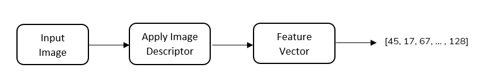

<!-- PROJECT LOGO -->

  <h2 align="center">Predict Album Genre and Popularity</h2>
  

    Predict Genre and Popularity of a music album, based on the album's cover.
  

   
   

<!-- TABLE OF CONTENTS -->

  
Table of Contents

  <ol>
    <li>
      <a href="#spotify-api">Spotify API</a>
    </li>
    <li>
      <a href="#build-dataset">Build Dataset</a>
    </li>
        <li>
      <a href="#explore-dataset">Explore Dataset</a>
    </li>
     </li>
    <li>
      <a href="#feature-extraction">Feature Extraction</a>
    </li>
    <li>
      <a href="#predict-popularity">Predict Popularity</a>
    </li>
    <li>
      <a href="#classify-genre">Classify Genre</a>
    </li>
    <li>
      <a href="#challenges-so-far">Challenges so far</a>
    </li>
  </ol>
   
   

 
 
## Spotify API    

[`view notebook`](https://nbviewer.jupyter.org/github/bojito/ml-album-popularity/blob/main/1%20-%20Spotify%20API.ipynb)
  
Contains the implementation of the SpotifyAPI class. 

The Client Credentials Flow is used for authentication, please refer to [https://developer.spotify.com](https://developer.spotify.com/documentation/general/guides/authorization-guide/#client-credentials-flow)

**Features:**
* Spotify API token generation and renewal
* Various endpoints requests

**Usage:**
* Create a config.py with your `client_id`, `client_secret` keys.

## Build Dataset

[`view notebook`](https://nbviewer.jupyter.org/github/bojito/ml-album-popularity/blob/main/2%20-%20Build%20Dataset.ipynb)

To build the dataset, the playlist [*Most Popular Songs of All Time*](https://open.spotify.com/playlist/4o8NBsWreC3OnKePUYw0dg?si=KfEHTYmESlORo6CeDsf1bg) from Spotify was used.

Up to the point of downloading the metadata, the playlist consisted of **3.300 songs** and 204 hours of music.

**Key points**

* the playlist contained songs from the same album. Each album cover is downloaded once and the final dataset has **2.370 unique album cover images**.
* the genres are maintained at artist level in the spotify API. Seperate request per album artist.
* the dataset is stored in a `json` file with the following keys: {artist_id, artist_name, album_id, album_name, album_popularity, genres, album_url}

## Explore Dataset 

[`view notebook`](https://nbviewer.jupyter.org/github/bojito/ml-album-popularity/blob/main/3%20-%20Explore%20Dataset.ipynb)

Expore the dataset regarding album popularity and genres. 

**Key points**

* Filter out albums with popularity less than 40. Spotify API returns a popularity value between 0-100.
* Spotify API returns multiple genres per artist, we keep the most common and filter out the rest based on their corellation.
* The albums are annotated as pop, rap and rock. The albums that don't belong to one of these genres are removed. 

The final dataset contains **1.592 samples** and has the folowing distribution of genres:

| Genre         | Albums Count      | 
| ------------- |-----------:| 
| pop           |         751| 
| rap           |         542| 
| rock          |         299| 

## Feature Extraction 

[`view notebook`](https://nbviewer.jupyter.org/github/bojito/ml-album-popularity/blob/main/4%20-%20Extract%20Features.ipynb)

The following features are extracted from each image:

* `has_face`: that indicates if a **face** is present in the album cover
* `hog_descriptor` : that quantifies the **structure** of the image  
* `hsv_hist` : that quantifies the **color** of the image
* `lbp_hist` : that quantifies the **texture** of the image

**Combining Features**

`hog_descriptor`, `hsv_hist`, `lbp_hist` are  feature descriptors that quantify an image **globally**.  To combine them, we concatenate each feature vector to form a single global feature vector. 

  

## Predict Popularity

[`view notebook`](https://nbviewer.jupyter.org/github/bojito/ml-album-popularity/blob/main/5%20-%20Predict%20Popularity.ipynb)

## Classify Genre

[`view notebook`](https://nbviewer.jupyter.org/github/bojito/ml-album-popularity/blob/main/6%20-%20Classify%20Genre.ipynb)

## Challenges so far 

* Spotify API prevents continuous requests for downloading album cover images. Added 1 sec delay and a retry method.
* Artist genres are returned as a list, which is a bit tricky to handle in pandas. 
* Spotify API returns a large number of different genres. Had to keep the most common ones by using corellation matrix. (Perform clustering for better results
* Dataset contains more examples from pop genre compared to rock, rap. Should balance classes with more data.
